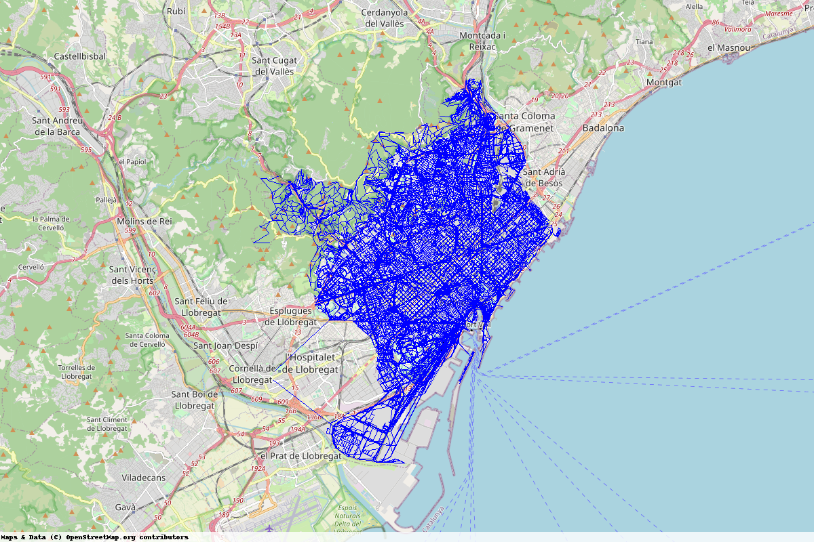
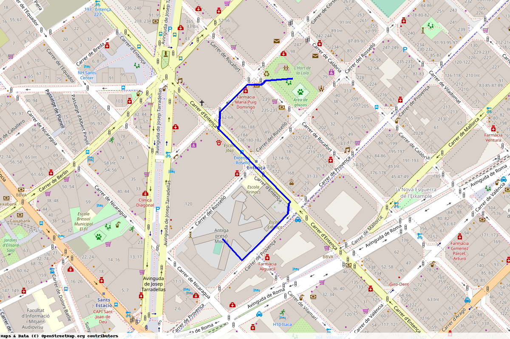

# CINEBUS - AP2 GCED Q2 SPRING 2023

## Biel Altimira Tarter

Cinebus is a project that allows anybody to look through the data related to films and cinemas, chose a desired projection and reach out to the cinema the fastest way by bus and also walking when necesary. The program is operated through a CLI menu on the terminal that allows you to download the data, create the graphs, look for films and find the easiest way to get somewhere.


## Getting Started

All the needed code and data is provided in this directory, everything extra is downloaded by the program itself. Just note that since the creation of the City graph takes from 3 to 5 minutes, I've also provided the pickle file for quick debug and checking. Nonetheless, the method to create the City graph works perfectly if provided with the needed time.

### Prerequisites

All the prerequisites are provided within the file:

```
requirements.txt
```

since the project has been developed using the virtual environment module `virtualenv`. I first started using `conda` but stumbled upon some compatibility issues and missing packages so I decided to make the transition.

The python version used is `3.11.3`

### Installing

To run the project, no further installations are needed, just make sure the python verion is the same and install the requirements using pip:

```
python3 -m pip install -r requirements.txt
```

Or in case of anaconda (bear in mind some packages were not found)

```
conda install --file requirements.txt
```

## Billboard

The billboard module gathers all the data related to cinemas and films. It uses generators to acquire all the data in an ordered way. Also, some auxiliary functions have been defined in order to build the objects of the created datasctructures by gathering the needed data out of a raw piece of information extracted from the web.

## Buses
The buses module creates the Line and Stop hashable data structures and by iterating over the ATM data, it creates the different nodes and edges. Since at each moment we know the node we are working with, the nodes are the Stop objects themselves. This simplifies access to their attributes and doesn't obstruct the search, since it's not performed in this module.

The programming style and workflow is similar to the billboard module.

## City

This module creates the key graph, the city graph, union of both buses and the OSMnx graph of the city of BCN that is obtained in this module. The way it works is by iterating seperatedly among the nodes and edges of both buses and streets graph. The nodes are identifiers with attributes containing the Stop, Cruilla dataclasses, color, and weight.

The weight is a time value obtained by dividing the length of the edge by the speed of crossing the edge plus some constant if it's a bus, since it takes some extra time to load and unload the passengers.

Unfortunately, the weights are not very well calibrated and most of the times, the method that finds the paths priorizes walking instead of taking a bus, which is sometimes unrealistic.

Also, it adds an edge from each stop to the nearest cruilla, operation that taking a long time. I have experimented using OSMnx built in functions and other alternatives using multithreading, but iterating by hand has given me the best results.


## Demo
The demo simply uses a class-menu approach to provide all the asked functionalities and user-friendly navigation.


## Conclusion
My project is functional and meets most of the asked requirements, as an improvement, a better weight calibartion would lead to better optimal cinema finding, since i'm also not taking into accont the time it takes to get to the cinema. However, my main focus has been on providing clean and readable code as well as documenting everything and using all the tools that I can perfectly understant how they work under the hood.


## Testing
To prevent having to generate the city graph over and over again, the citygraph.pickle file has been provided, and on the `demo.py` and `city.py` files, some pieces of code are commented out in order to directly load the graph using this pre-created pickle file. This way it's easier to debug, fix, or just explore in depth the way my code works, without needing to reload.


## Built With

* [NetworkX](https://networkx.org/) - Custom graph creation
* [OSMnx](https://osmnx.readthedocs.io/en/stable/) - City graph preloaded with data

## Versioning

I have used Git during the development of this project, so all the different versions and commits are available.

## Authors

* **Biel Altimira Tarter**

## Acknowledgments

* UPC - Universitat Politècnia de Catalunya
